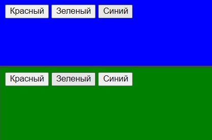
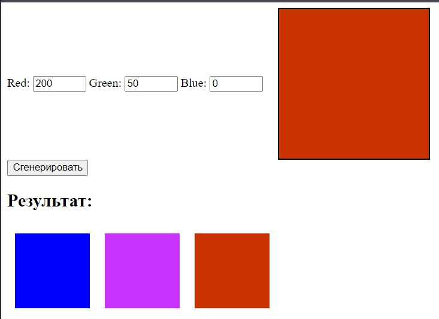
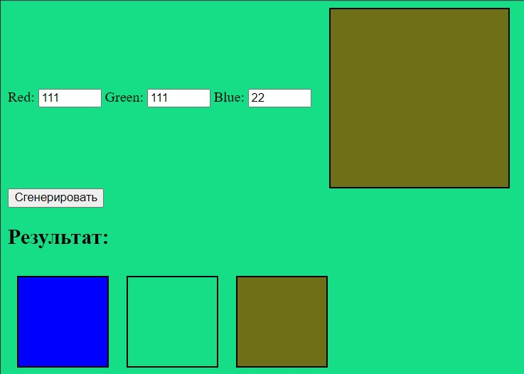
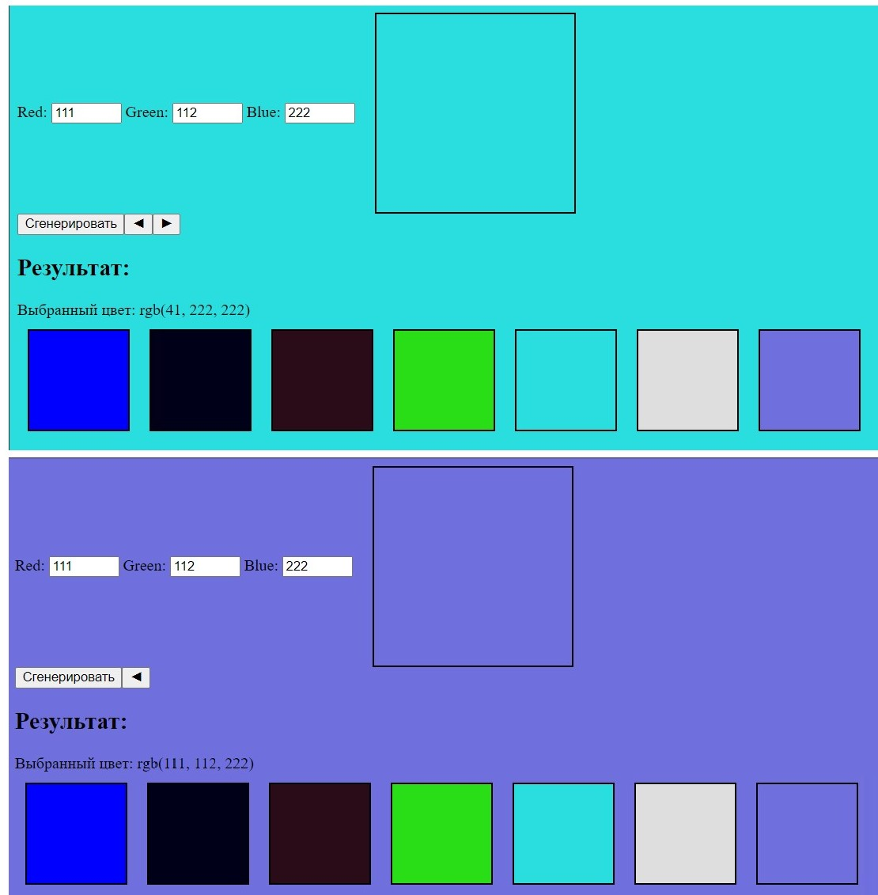

# Обработка событий в java script

## Отчет по Лаб. №8
## ст. Куриленко М.О.
## гр. АСБ-3-036

------------

### Задание 1. Начало
### Вывод:

### Задание 2. Добавления функционала
### Вывод:

### Задание 3. Работа со списками и объектами на практике
### Вывод:

### Задание 4. Финальный этап
### Вывод:

### Задание 5. Создание слайдера (задание со звездочкой)
### Вывод:

