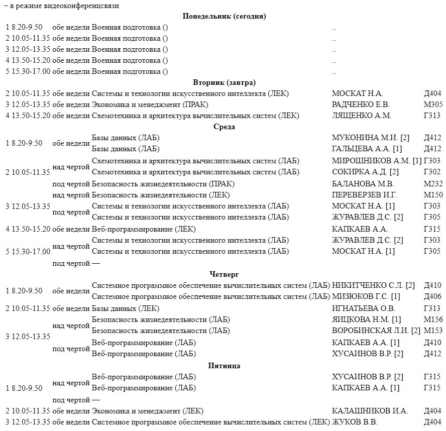

# Инструменты разработчика в браузере

## Отчет по Лаб. №2
## ст. Бондарь С.А.
## гр. АСБ-3-036

------------

### Задание №1. Исследование заголовков и тела обычных запросов и их ответов.

```shell
< **Request URL:** https://ya.ru/ - "Веб-сайт, с которого были запрошены данные" 
< **Request Method:** GET - "Выполняется запрос для полученые GET данных"
< **Status Code:** 200 - "Запрос успешно запрошен"
< **Remote Address:** 77.88.55.242:443 - "IP-адрес и порт удаленного сервера"
< **Referrer Policy:** strict-origin-when-cross-origin - "Политика безопасности, которая указывает на отправку информации о реферере"
< **Content-Type:** text/html; charset=UTF-8 - "Тип контента, который содержится в HTTP-ответе"
< **Cache-Control:** no-cache,no-store,max-age=0,must-revalidate - "Браузер не кешируется"
< **Cookie:** is_gdpr=0; is_gdpr_b=COj6IhDAzgEoAg==; yandex_csyr=1694757079; (и еще много инфы) - "Файлы  ~~печеньки~~ куки, которые сайт использует для идентификации или настроек"
< **User-Agent:** Mozilla/5.0 (Windows NT 10.0; Win64; x64) AppleWebKit/537.36 (KHTML, like Gecko) Chrome/116.0.0.0 Safari/537.36 - "Информацию о браузере и операционной системе пользователя"
< **Referer** - "Адрес предыдущей страницы, с которой был осуществлен переход на текущую страницу"
```

#### Ответы на вопросы:
1. Ответил выше 👆
2. **77.88.55.242** - IP-адрес | 443 - порт
3. "Порт подключения" - это числовой код, который указывает на конкретное приложение или службу на компьютере или сервере, + еще  позволяет разным программам взаимодействовать через сеть одновременно.
4. Заголовки разделены на 3 секции: 
	- **General (Общее)** - секция содержит общую информацию о HTTP-запросе или ответе.
	- **Response Headers (Заголовки ответа)** - секция содержат информацию о сервере, дате, типе содержимого и другие метаданные, связанные с ответом.
	- **Request Headers (Заголовки запроса)** - перечислены заголовки, отправляемые клиентом. Могут содержать информацию о браузере, языковых предпочтениях, cookies и другие параметры, связанные с запросом.
5. Заголовок **Cache-Control** повторяется в **Response Headers** и **Request Headers**. Повторение этого заголовка в обеих секциях позволяет синхронизировать настройки кэширования между браузером и сервером, обеспечивая более эффективное управление кэшем и оптимизацию загрузки страницы. 
6. Тело ответа представляет собой данные, которые сервер отправляет в ответ на HTTP(S)-запрос. Эти данные могут быть в различных форматах(HTML, JSON и т.п)

------------

### Задание №2. Исследование указывающих ответов сервера.

#### Ответы на вопросы:
1. Изменение адреса в адресной строке произошло после выполнения поискового запроса на сайте "ya.ru" с использованием параметра text, который содержал URL "http://rgups.ru/".
	- **Какие заголовки в этом поучаствовали:**
	- **Request Method:** GET указывает на то, что клиент (браузер) выполнил HTTP GET-запрос к серверу по указанному URL.
	- **text=http%3A%2F%2Frgups.ru%2F:** В этом параметре передается текст поискового запроса, который содержит URL "http://rgups.ru/". (%3A - ":" и %2F - "/") используется для передачи специальных символов в URL.
	- **Referer:** Заголовок указывает на страницу "https://ya.ru/", с которой был выполнен текущий "http://rgups.ru/" запрос.
2. Адрес был изменен в исходном запросе без дополнительных запросов.
3. Первоначальный запрос вернул статус ответа **200**, что означает **успешное** выполнение запроса.

------------

### Задание №3. Исследование получения и передачи cookie.

#### Ответы на вопросы:
1. **Название(Формат данных):** 
- Name(user_id),
- Value(12345 или JohnDoe),
- Expires/Max-Age(Sat, 01 Jan 2023 00:00:00 GMT или в сек. 3600 для 1-го часа),
- Domain(rgups.ru),
- Path(/products),
- Secure(защищенное HTTPS-соединение),
- HTTP Only(доступен только через HTTP-запросы и недоступен JavaScript),
- SameSite(кросс-сайтовые запросы: Strict, Lax, None),
- Partition Key(строка, число или другой тип данных, в зависимости от конкретной базы данных или системы хранения данных),
- Priority(числовое значение или уровень приоритета(Пример: 7 или Medium)).
2. **Чтобы удобно просмотреть все cookie, нужно:**
	 - Открыть интрересующийся нам веб-сайт.
	 - Нажать клавишу F12.
	 - Перейти во вкладку Application.
	 - В левой панели выберите Cookies в разделе Storage. 
	- Здесь мы увидим список всех cookie, используемых на данной странице.
- **Name** - "Ключ(Name)-значение(Служебные cookie)."
- **Value** - "Значение, связанное с данным именем cookie.(Любая строка/или данные, которые сохраняет комп."
- **Domain** - "Домен, к которому относится cookie."
- **Path** - "Создание cookie, для какой-то конкретной страницы на сайте."
- **Expires** - "Дата и время когда ~~печенье~~ cookie будет ~~съедено~~ удалено из системы."
3. **Чтобы просмотреть все cookie связанные с текущим сайтом, нужно:**
	- Открыть интрересующийся нам веб-сайт.
	- CTRL + SHIFT + I.
	- Перейти во вкладку Application.
	- В левой панели выберите Cookies в разделе Storage. 
	- У каждой cookie есть свой Domain, к которой ~~печенье~~ cookie привязано:)
4. **Cookie** - это ~~ПЕЧЕНЬКА~~ небольшие файлы, которые веб-сайты отправляют на комп, чтобы запомнить инфу о нас. Например, они используются для хранения настроек или идентификации нас при следующих посещениях сайта.

------------

### Задание №4. Исследование построения документов и сопутствующих запросов.

#### Ответы на вопросы:
1. **DOM (Document Object Model)** - это структура веб-сайта в виде дерева объектов, которые можно изменять и взаимодействовать с ними.
2. **Да**, итоговый документ может отличаться от тела ответа сервера по следующим причинам:
	- **Преобразования на клиенте|** Клиентский код имеет возможность изменять или дополнять ответ сервера перед отображением.
	- **Ошибки в передаче данных|** Не стоит искл. ошибки при передаче данных между сервером и клиентом, которые могут повлиять на содержание ответа.
	- **Кэширование|** Прокси-серверы или кэши имеют возможность возвращать предыдущие версии ответов.
	- **Динамические данные|** Бывает, что некоторое содержание страницы может быть динамическим(меняться в реальном времени или в зависимости от определенных событий/условий) и зависеть от действий пользователя, ну или других факторов.
	- **Локализация|** Ответ может быть адаптирован под локальные настройки или язык пользователя.
3. Огромное количество запросов и ответов происходят из-за множества дополнительных запросов и ответов, которые браузер автоматически создает при загрузке веб-страницы. Запросы представляют из себя запросы на: загрузку изображений, стилей, скриптов и других ресурсов, а также запросы для аналитики и отслеживания. Браузер делает их на основании HTML-кода страницы и указаний в нем, чтобы полностью отобразить веб-страницу для пользователя.

------------

### Задание №5. Определение параметров запроса сайт университета **RGUPS**
1. `https://www.rgups.ru/ajax/schedule.php?action=timetable&fac-id=1&course-id=3&group-id=26424&edu-type=internal` - **Просмотр расписание за 1 KLIK**
2. Чтобы просмотреть тело, нужно знать: "А как же его просмотреть?"
	1. Открываем главный сайт университета `https://www.rgups.ru/services/time/`
	2. Переходим во вкладку: Расписание, Очное-ИТУ, 3 курс.
	3. Далее `CTRL + SHIFT + I` и после этого выбираем группу (АСБ-3-036).
	4. В открывшийся вкладке разработчика в поле **Name** выбираем `schedule.php`
	5. После чего выбираем `Responce` и именно тут будет находиться тело отвера.
**Небольшой пример части тела:**
```html
<div class="schedule-section">
					<div class="schedule-section-legend"><i></i> – в режиме видеоконференцсвязи</div>
    		
    <table class="table">             <tr>
                <th class="" colspan="6">
                    Понедельник (сегодня)                </th>
            </tr>
                      <tr>
                        <td class="" >1</td>
                        <td class="" >8.20-9.50</td>
                        <td class="" >обе недели</td>
                            <td class="">Военная подготовка ()</td>
                            <td class=""> ..</td>
                            <td class=""></td>
.
.
.
                <th class=" info" colspan="6">
                    Вторник (завтра)                </th>
            </tr>
                      <tr>
                        <td class="success" >2</td>
                        <td class="success" >10.05-11.35</td>
                        <td class="success" >обе недели</td>
                            <td class="success">Системы и технологии искусственного интеллекта (ЛЕК)</td>
                            <td class="success">МОСКАТ Н.А.</td>
                            <td class="success">Д404</td>
                    </tr>
                      <tr>
                        <td class="" >3</td>
                        <td class="" >12.05-13.35</td>
                        <td class="" >обе недели</td>
                            <td class="">Экономика и менеджмент (ПРАК)</td>
                            <td class="">РАДЧЕНКО Е.В.</td>
                            <td class="">М305</td>
.
.
.
                        <td class="" >2</td>
                        <td class="" >10.05-11.35</td>
                        <td class="" >обе недели</td>
                            <td class="">Экономика и менеджмент (ЛЕК)</td>
                            <td class="">КАЛАШНИКОВ И.А.</td>
                            <td class="">Д404</td>
                    </tr>
                      <tr>
                        <td class="" >3</td>
                        <td class="" >12.05-13.35</td>
                        <td class="" >обе недели</td>
                            <td class="">Системное программное обеспечение вычислительных систем (ЛЕК)</td>
                            <td class="">ЖУКОВ В.В.</td>
                            <td class="">Д404</td>
                    </tr>

</table></div>
```
3. Тип: **POST**
4. Первое - это конечно (BASE) БАЗА... `https://www.rgups.ru/ajax/schedule.php?` - структура(тело), а делее:
	1. `action=timetable` - **Обращаемся к расписанию**
	2. `fac-id=1` - **ID факультета**
	3. `course-id=3` - **ID курса**
	4. `group-id=26424` - **ID группы**
	5. `edu-type=internal` - **Тип обучения**
**Как это выглядит:**

