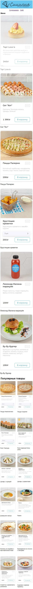
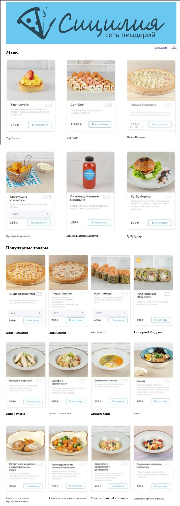

# Работа с HTML и CSS. Простые приёмы работа с DOM и BOM.

## Отчет по Лаб. №5
## ст. Куриленко М.О.
## гр. АСБ-3-036

------------

## Задание №1. Разработка HTML-документа

### Код задачи:

```html
<!DOCTYPE html>
<html lang="ru">
<head>
    <meta charset="UTF-8">
    <title>Лабораторная работа №5</title>
    <link rel="stylesheet" href="styles_**mobila или PC**.css">
</head>
<body>
    <header>
        
        <nav>
            <a href="https://pizza-sicilia.ru/about">Содержимое</a>
            <a href="https://pizza-sicilia.ru/">Сайт</a>
        </nav>
    </header>
    <main>
        <h1>Меню</h1>
        <div class="main-catalog">
            <div class="item">
                
                <p>Торт Love is</p>
            </div>
            <div class="item">
                
                <p>Сет "Хот"</p>
            </div>
            <div class="item">
                
                <p>Пицца Палермо</p>
            </div>
            <div class="item">
                
                <p>Хрустящие креветки</p>
            </div>
            <div class="item">
                
                <p>Лимонад Малина-маракуйя</p>
            </div>
            <div class="item">
                
                <p>Бу-Бу бургер</p>
        </div>
        <div class="promo-catalog">
            <h1>Популярные товары</h1>
            <div class="item">
                
                <p>Пицца Неаполитано</p>
            </div>
            <div class="item">
                
                <p>Пицца Сицилия</p>
            </div>
            <div class="item">
                
                <p>Ролл Темпура</p>
            </div>
            <div class="item">
                
                <p>Ролл жареный Моку унаги</p>
            </div>
            <div class="item">
                
                <p>Цезарь с курицей</p>
            </div>
            <div class="item">
                
                <p>Цезарь с креветками</p>
            </div>
            <div class="item">
                
                <p>Домашняя лапша</p>
            </div>
            <div class="item">
                
                <p>Рамен</p>
            </div>
            <div class="item">
                
                <p>Котлеты из индейки с картофельным пюре</p>
            </div>
            <div class="item">
                
                <p>Фрикадельки из лосося с овощами</p>
            </div>
            <div class="item">
                
                <p>Спагетти с креветкой и шпинатом</p>
            </div>
            <div class="item">
                
                <p>Сырники с кремом тирамису</p>
	    </div>
        </div>
    </main>
    <script src="script.js"></script>
</body>
</html>
```
## Задание №2. Стили мобильной версии

```css
body {
    margin: 0;
    padding: 0;
    font-family: Arial, sans-serif;
}

header {
    text-align: center;
    padding: 12px;
}

img {
    max-width: 100%;
    height: auto;
}

nav {
    margin-top: 12px;
}

nav a {
    text-decoration: underline;
    font-size: 25px;
}

nav a:hover {
    text-decoration: none;
}

nav a:last-child {
    margin-left: 30px;
}

.main-catalog, .promo-catalog {
    margin: 0 12px;
}

.item {
    margin-bottom: 20px;
}

.item img {
    width: 100%;
    height: auto;
}

.item p {
    font-size: 40px;
    margin-bottom: 100px;
}

.promo-catalog h2 {
}

.item:hover {
    opacity: 0.6;
}

.promo-catalog {
    display: flex;
    flex-wrap: wrap;
    justify-content: space-between;
    margin-left: -12px;
    margin-right: -12px;
}

main h1 {
    margin-left: 20px;
}

.promo-catalog h1 {
    width: 100%;
    margin: 0 0 20px;
    font-size: 70px;
    margin-left: 20px;
}

.promo-catalog .item {
    width: calc(50% - 12px);
    margin-bottom: 20px;
    padding: 12px;
    box-sizing: border-box;
}
```
### Вывод задачи №2:



## Задание №2. Адаптация под десктопы

```css
body {
margin: 0 40px;
}

header {
    text-align: left;
}

img {
    margin: 12px 0;
    max-width: 100%;
    height: auto;
}

nav {
    margin-top: 0;
    float: right;
}

nav a:last-child {
    margin-left: 30px;
}

.main-catalog .item:hover img,
.promo-catalog .item:hover img {
    opacity: 0.6;
    transition: opacity 0.3s ease;
}

.main-catalog {
margin: 0;
display: flex;
flex-wrap: wrap;
justify-content: space-between;
}

.main-catalog .item {
width: calc(33.33% - 24px);
margin-right: 24px;
margin-bottom: 40px;
font-size: 18px;
}

.promo-catalog {
    margin: 0;
    display: flex;
    flex-wrap: wrap;
    justify-content: space-between;
}

.promo-catalog h1 {
    width: 100%;
    margin: 0 0 20px;
}

.promo-catalog .item {
    width: calc(25% - 20px);
    margin-right: 20px;
}
```
### Вывод задачи №3:


